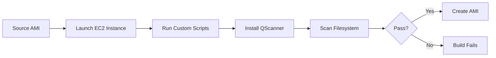
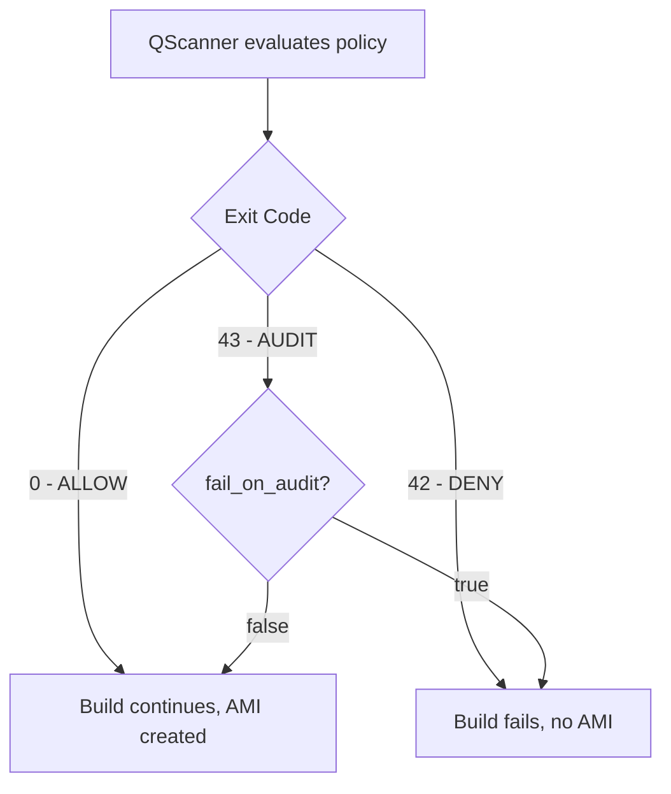

# Golden AMI Pipeline with Qualys QScanner

Build hardened, vulnerability-scanned Amazon Machine Images using HashiCorp Packer and Qualys QScanner. Every AMI is scanned for OS vulnerabilities, software composition risks, secrets, and misconfigurations before it becomes available for use.

## How It Works



Packer launches an EC2 instance from a base AMI, runs your provisioning scripts, then downloads and executes QScanner against the live root filesystem. Scan results are pulled back to your local machine. If you enable policy evaluation, the build will fail when vulnerabilities exceed your configured thresholds.

QScanner is downloaded fresh for each build and removed before the AMI snapshot. Nothing is baked into the final image.

## Prerequisites

- [Packer](https://developer.hashicorp.com/packer/install) installed
- AWS credentials configured (`aws configure` or environment variables)
- Qualys access token and pod identifier

## Quick Start

```bash
export QUALYS_ACCESS_TOKEN=<your-token>

packer init packer/
packer build -var "qualys_pod=US1" packer/
```

This builds an Amazon Linux 2023 golden AMI with a full vulnerability report. The scan runs in `get-report` mode by default, which produces a report but does not block the build.

## Build Gating with Policy Evaluation

To fail the build when vulnerabilities exceed your Qualys policy thresholds:

```bash
packer build \
  -var "qualys_pod=US1" \
  -var "qualys_mode=evaluate-policy" \
  -var "qualys_policy_tags=production,pci" \
  packer/
```



Policy rules are managed centrally in the Qualys portal. QScanner enforces them at build time without any changes to your engineering workflow.

## Using Variable Files

Variable files let you define reusable configurations for different OS targets:

```bash
packer build -var-file=packer/amazon-linux-2023.pkrvars.hcl packer/

packer build -var-file=packer/ubuntu-2404.pkrvars.hcl packer/
```

Two examples are included:

| File | OS | Mode | Description |
|------|-----|------|-------------|
| `amazon-linux-2023.pkrvars.hcl` | AL2023 | `get-report` | Scan and report, no gating |
| `ubuntu-2404.pkrvars.hcl` | Ubuntu 24.04 | `evaluate-policy` | Scan with policy enforcement |

## Custom Provisioner Scripts

Run your own hardening, patching, or application install scripts before the scan:

```bash
packer build \
  -var "qualys_pod=US1" \
  -var 'custom_scripts=["scripts/harden.sh","scripts/install-app.sh"]' \
  packer/
```

Custom scripts run before QScanner, so the scan covers everything you install.

## SSM Session Manager

By default, Packer connects to the build instance over SSH (port 22). You can switch to SSM Session Manager for a more secure connection that requires no open ports:

```bash
packer build \
  -var "qualys_pod=US1" \
  -var "use_session_manager=true" \
  -var "iam_instance_profile=YourSSMRole" \
  packer/
```

When SSM is enabled:
- No security group rules are created
- No public IP is assigned
- The instance only needs an IAM role with SSM permissions

## Variables Reference

### AWS Configuration

| Variable | Type | Default | Description |
|----------|------|---------|-------------|
| `region` | string | `us-east-1` | AWS region |
| `source_ami_id` | string | | Explicit AMI ID (overrides filter) |
| `source_ami_filter_name` | string | `al2023-ami-*-x86_64` | AMI name filter pattern |
| `source_ami_owners` | list | `["amazon"]` | AMI owner account IDs |
| `instance_type` | string | `t3.medium` | EC2 instance type |
| `ssh_username` | string | `ec2-user` | SSH user |
| `ami_name_prefix` | string | `golden-ami` | Output AMI name prefix |
| `ami_tags` | map | `{}` | Additional AMI tags |
| `custom_scripts` | list | `[]` | Pre-scan provisioner scripts |
| `subnet_id` | string | | VPC subnet ID |
| `vpc_id` | string | | VPC ID |
| `associate_public_ip` | bool | `true` | Assign public IP |
| `use_session_manager` | bool | `false` | Use SSM instead of SSH |
| `iam_instance_profile` | string | | IAM instance profile |
| `temporary_security_group_source_cidrs` | list | `[]` | Allowed SSH CIDRs (defaults to `0.0.0.0/0` if empty) |

### QScanner Configuration

| Variable | Type | Default | Description |
|----------|------|---------|-------------|
| `qualys_access_token` | string | `env("QUALYS_ACCESS_TOKEN")` | Qualys access token (sensitive) |
| `qualys_pod` | string | `US1` | Qualys platform pod |
| `qualys_scan_types` | string | `os,sca,secret,fileinsight` | Scan types to run |
| `qualys_mode` | string | `get-report` | `get-report`, `evaluate-policy`, `scan-only`, or `inventory-only` |
| `qualys_policy_tags` | string | | Policy tags for evaluate-policy mode |
| `qualys_scan_timeout` | string | `5m` | Scan timeout |
| `qualys_report_format` | string | `table,sarif` | Report output formats |
| `qualys_exclude_dirs` | string | `/proc,/sys,/dev,/run,/tmp` | Directories to skip |
| `fail_on_audit` | bool | `false` | Fail build on AUDIT result |
| `qscanner_version` | string | `latest` | QScanner version to download |

## Scan Types

| Type | What It Scans |
|------|---------------|
| `os` | OS package vulnerabilities (RPM, dpkg, apk) |
| `sca` | Software composition analysis (Java, Go, Python, Node, .NET) |
| `secret` | Leaked credentials, API keys, private keys |
| `fileinsight` | Non-package file analysis |
| `compliance` | CIS benchmark compliance checks |
| `malware` | Malware detection |

## Scan Modes

| Mode | Backend Required | Report | Build Gating |
|------|-----------------|--------|--------------|
| `inventory-only` | No | Local inventory files | No |
| `scan-only` | Yes | Results in Qualys UI | No |
| `get-report` | Yes | Console + SARIF + JSON | No |
| `evaluate-policy` | Yes | Console + SARIF + JSON | Yes |

## Output

Scan artifacts are downloaded to the `output/` directory after each build:

- Tabular vulnerability report (console output)
- SARIF report for integration with code scanning tools
- JSON report with full vulnerability details

## Project Structure

```
qualys-packer/
  packer/
    golden-ami.pkr.hcl               Main Packer template
    variables.pkr.hcl                Variable declarations
    amazon-linux-2023.pkrvars.hcl    AL2023 example config
    ubuntu-2404.pkrvars.hcl          Ubuntu 24.04 example config
  scripts/
    install-qscanner.sh              Downloads QScanner binary
    run-qscanner-scan.sh             Executes the scan
    cleanup-qscanner.sh              Removes QScanner before snapshot
  output/                            Scan artifacts (gitignored)
```

## EC2 Image Builder

An alternative to Packer using the fully managed AWS EC2 Image Builder service. QScanner runs in the **test phase** — after the AMI snapshot is taken, on a fresh instance launched from the candidate image. If the scan fails, the AMI is not distributed.

| | Packer | EC2 Image Builder |
|---|---|---|
| Scan timing | Pre-snapshot (build phase) | Post-snapshot (test phase) |
| Cleanup needed | Yes | No (test instance is discarded) |
| Secrets | Env vars from CI/CD | SSM Parameter Store (SecureString) |
| Results | File provisioner download | S3 upload |
| Multi-region | Manual | Built-in distribution |
| Scheduling | Jenkins/GitHub cron | Built-in pipeline scheduling |
| Cost | EC2 + CI/CD tool | EC2 only (service is free) |

### Deploy

```bash
# Store your Qualys token in SSM Parameter Store
aws ssm put-parameter \
  --name /qualys/access-token \
  --type SecureString \
  --value "<your-token>"

# Deploy the pipeline
aws cloudformation deploy \
  --template-file image-builder/pipeline.yml \
  --stack-name qualys-golden-ami \
  --parameter-overrides \
    QualysPod=CA1 \
    QualysMode=get-report \
    ResultsBucketName=my-scan-results-bucket \
  --capabilities CAPABILITY_NAMED_IAM

# Trigger a build
PIPELINE_ARN=$(aws cloudformation describe-stacks \
  --stack-name qualys-golden-ami \
  --query 'Stacks[0].Outputs[?OutputKey==`PipelineArn`].OutputValue' \
  --output text)

aws imagebuilder start-image-pipeline-execution \
  --image-pipeline-arn "$PIPELINE_ARN"
```

### Files

```
image-builder/
  pipeline.yml                     CloudFormation template (full pipeline)
  qscanner-test-component.yml     Standalone component (use in existing pipelines)
```

The standalone component (`qscanner-test-component.yml`) can be added to any existing Image Builder recipe as a test component.

## Security

- Access tokens are never logged. The Packer scan script redacts the token from all command output. The Image Builder component retrieves the token from SSM Parameter Store at runtime.
- QScanner is downloaded, used, and removed within a single build. Nothing persists in the AMI.
- SSH access CIDRs are configurable. Use `temporary_security_group_source_cidrs` to restrict access, or enable `use_session_manager` to avoid opening port 22 entirely.
- The access token variable is marked `sensitive` in Packer, which prevents it from appearing in plan output.
- The Image Builder pipeline uses least-privilege IAM with access scoped to the specific SSM parameter and S3 bucket.

## Project Structure

```
qualys-packer/
  packer/
    golden-ami.pkr.hcl               Packer template
    variables.pkr.hcl                Variable declarations
    amazon-linux-2023.pkrvars.hcl    AL2023 example config
    ubuntu-2404.pkrvars.hcl          Ubuntu 24.04 example config
  image-builder/
    pipeline.yml                     CloudFormation template (full pipeline)
    qscanner-test-component.yml     Standalone component for existing pipelines
  scripts/
    install-qscanner.sh              Downloads QScanner (Packer)
    run-qscanner-scan.sh             Executes the scan (Packer)
    cleanup-qscanner.sh              Removes QScanner before snapshot (Packer)
  .github/workflows/
    build-golden-ami.yml             GitHub Actions workflow
  Jenkinsfile                        Jenkins pipeline
  output/                            Scan artifacts (gitignored)
```

## License

Apache License 2.0
