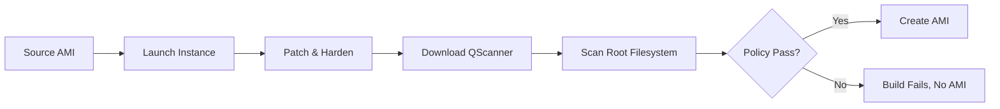
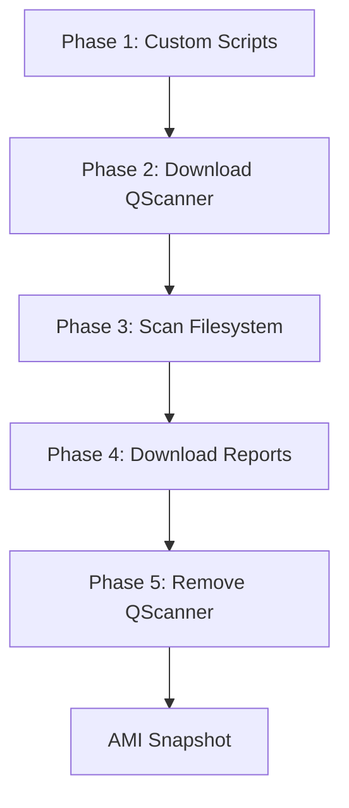

# Building Secure Golden AMIs with Qualys QScanner and HashiCorp Packer

Golden AMIs are the foundation of secure infrastructure on AWS. Every EC2 instance, Auto Scaling group, and launch template starts from an AMI, and if that AMI has vulnerabilities baked in, those vulnerabilities ship to production.

This post walks through a pipeline that integrates Qualys QScanner directly into the Packer build process. The result: every golden AMI is scanned for vulnerabilities, secrets, and software composition risks before it exists. No separate scanning infrastructure. No manual approval workflows. Just a single `packer build` command.

## The Problem with Post-Build Scanning

Most golden AMI pipelines look something like this:

1. Build the AMI with Packer
2. Launch an instance from the AMI
3. Install a scanning agent or run a network scan
4. Wait for results
5. Manually approve or reject

This works, but it has real problems. There is a window where an unscanned AMI exists and could be used. The scanning step requires its own infrastructure (scanner appliances, Lambda functions, SSM automation documents). The approval is often manual, which means it is slow and inconsistent.

## A Better Approach: Scan During Build

What if the vulnerability scan happened during the Packer build itself, before the AMI is created?



With this approach, a vulnerable AMI never exists. If the scan fails, Packer stops and no AMI is created. There is nothing to clean up, no window of exposure, and no manual approval step.

## How It Works

QScanner is a standalone binary. No installation, no agents, no deployment. You download it, point it at a filesystem, and get a vulnerability report. That makes it a natural fit for Packer provisioners.

The pipeline has five phases, all running as Packer provisioners on the EC2 build instance:



**Phase 1** runs your existing provisioner scripts. OS patching, CIS hardening, application installs, whatever you already do.

**Phase 2** downloads the QScanner binary from qualys.com. The official download script detects the instance OS and architecture and pulls the right binary. No pre-staging required.

**Phase 3** runs `qscanner rootfs /` against the live filesystem. This scans everything: OS packages (RPM, dpkg, apk), software composition (Java, Go, Python, Node), leaked secrets, and file-level analysis. The scan runs against the actual state of the instance after all your provisioning is done.

**Phase 4** pulls the scan artifacts (SARIF reports, JSON results) back to your local machine so you have them regardless of whether the build succeeds or fails.

**Phase 5** removes the QScanner binary, cache, and all scan artifacts from the instance. Nothing persists in the final AMI.

## Two Modes: Report and Gate

The pipeline supports two ways to use QScanner.

**Report mode** (`get-report`) runs the scan, produces vulnerability reports, and lets the build continue regardless of findings. Use this when you are getting started and want visibility without blocking builds.

```bash
export QUALYS_ACCESS_TOKEN=<your-token>

packer build -var "qualys_pod=US1" packer/
```

**Policy evaluation mode** (`evaluate-policy`) runs the scan and evaluates the results against policies configured in the Qualys portal. If the policy says deny, the build fails.

```bash
packer build \
  -var "qualys_pod=US1" \
  -var "qualys_mode=evaluate-policy" \
  -var "qualys_policy_tags=production" \
  packer/
```

The exit code handling is straightforward:

| Exit Code | Meaning | Build Result |
|-----------|---------|--------------|
| 0 | ALLOW | AMI created |
| 42 | DENY | Build fails |
| 43 | AUDIT | Configurable |

AUDIT results pass by default. Set `fail_on_audit=true` if you want stricter enforcement.

Policy rules are managed in the Qualys portal. Security teams define the thresholds, and the pipeline enforces them. Developers and DevOps teams do not need to change anything about how they build AMIs.

## What Gets Scanned

QScanner covers a wide range of scan types:

- **OS packages**: Vulnerabilities in RPM, dpkg, and apk packages across Amazon Linux, Ubuntu, RHEL, CentOS, Debian, SUSE, and more
- **Software composition**: Dependencies in Java (Maven, Gradle), Go, Python (pip, Poetry), Node (npm, yarn), .NET (NuGet), Ruby, and Rust
- **Secrets**: API keys, private keys, credentials, and tokens that should not be in an AMI
- **File insight**: Non-package file analysis for additional security findings
- **Compliance**: CIS benchmark checks
- **Malware**: Known malware signatures

The default configuration runs `os,sca,secret,fileinsight`, which covers the most common concerns for golden AMIs.

## Security Considerations

A few things about how the pipeline handles sensitive data:

**Access tokens are redacted.** The scan script masks the Qualys access token in all log output. The token is passed as an environment variable and marked `sensitive` in Packer, which prevents it from appearing in plan output.

**QScanner leaves no trace.** The binary, cache, and all scan artifacts are removed before the AMI snapshot. The cleanup script removes:
- `/tmp/qscanner` (binary)
- `/tmp/qscanner-install` (download artifacts)
- `/tmp/qscanner-output` (scan results)
- `~/.cache/qualys/qscanner` (cache)
- `~/qualys/qscanner/data` (data directory)

**SSH access is configurable.** By default, Packer opens port 22 to connect to the build instance. You can restrict this with `temporary_security_group_source_cidrs` or avoid it entirely by using SSM Session Manager:

```bash
packer build \
  -var "qualys_pod=US1" \
  -var "use_session_manager=true" \
  -var "iam_instance_profile=YourSSMRole" \
  packer/
```

With SSM, no security group rules are created and no public IP is assigned.

## Variable Files for Multiple OS Targets

Different teams often need golden AMIs for different operating systems. Variable files make this simple:

**Amazon Linux 2023** with report-only scanning:

```hcl
region                 = "us-east-1"
source_ami_filter_name = "al2023-ami-*-x86_64"
source_ami_owners      = ["amazon"]
ssh_username           = "ec2-user"
ami_name_prefix        = "golden-ami-al2023"
qualys_pod             = "US1"
qualys_mode            = "get-report"
```

**Ubuntu 24.04** with policy enforcement:

```hcl
region                 = "us-east-1"
source_ami_filter_name = "ubuntu/images/hvm-ssd-gp3/ubuntu-noble-24.04-amd64-server-*"
source_ami_owners      = ["099720109477"]
ssh_username           = "ubuntu"
ami_name_prefix        = "golden-ami-ubuntu-2404"
qualys_pod             = "US1"
qualys_mode            = "evaluate-policy"
qualys_policy_tags     = "production"
fail_on_audit          = true
```

Build with:

```bash
packer build -var-file=packer/amazon-linux-2023.pkrvars.hcl packer/
packer build -var-file=packer/ubuntu-2404.pkrvars.hcl packer/
```

## CI/CD Integration

Since everything is a single `packer build` command, integration with CI/CD systems is straightforward. Here is a GitHub Actions example:

```yaml
name: Build Golden AMI

on:
  schedule:
    - cron: '0 6 * * 1'
  workflow_dispatch:

jobs:
  build:
    runs-on: ubuntu-latest
    steps:
      - uses: actions/checkout@v4

      - uses: hashicorp/setup-packer@main

      - run: packer init packer/

      - run: packer build -var-file=packer/amazon-linux-2023.pkrvars.hcl packer/
        env:
          QUALYS_ACCESS_TOKEN: ${{ secrets.QUALYS_ACCESS_TOKEN }}
          AWS_ACCESS_KEY_ID: ${{ secrets.AWS_ACCESS_KEY_ID }}
          AWS_SECRET_ACCESS_KEY: ${{ secrets.AWS_SECRET_ACCESS_KEY }}
          AWS_DEFAULT_REGION: us-east-1

      - uses: actions/upload-artifact@v4
        if: always()
        with:
          name: scan-results
          path: output/
```

The scan artifacts are uploaded as build artifacts so they are available for review even when the build fails.

## Comparing Approaches

The traditional Qualys golden AMI pipeline (using CloudFormation, SSM Automation, Lambda, and SNS) provides a comprehensive solution with continuous re-assessment and cross-account distribution. This Packer-based approach is simpler and focuses specifically on the build-time scan.

| Aspect | Traditional Pipeline | Packer + QScanner |
|--------|---------------------|-------------------|
| Infrastructure | CloudFormation stack, Lambda, SSM, SNS | None (Packer + shell scripts) |
| Scanning | Qualys Scanner Appliance + Cloud Agent | QScanner CLI (agentless) |
| Approval | Manual via SNS email | Automated via policy evaluation |
| Continuous Assessment | Yes (scheduled re-scans) | No (build-time only) |
| Distribution | Built-in (Service Catalog, cross-account) | Separate (use your existing process) |
| Setup Time | Hours | Minutes |

The two approaches are not mutually exclusive. You can use this pipeline for build-time scanning and still run continuous assessment separately using the Qualys Cloud Agent installed in your AMIs.

## Getting Started

1. Clone the repository
2. Set your Qualys access token: `export QUALYS_ACCESS_TOKEN=<token>`
3. Initialize Packer: `packer init packer/`
4. Build: `packer build -var "qualys_pod=US1" packer/`

The first build will take a few minutes to download QScanner and run the scan. Subsequent builds benefit from Packer's caching.

Check the scan artifacts in `output/` for the vulnerability report. When you are ready to enforce policies, switch to `evaluate-policy` mode and configure your rules in the Qualys portal.
